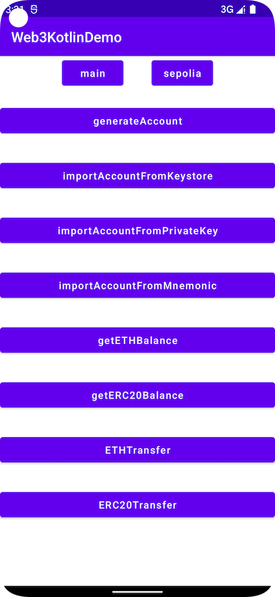

# Web3Kotlin
**Web3Kotlin** is an Android toolbelt for interaction with the Ethereum network.




For more specific usage, please refer to the [demo](https://github.com/smithSophiav/Web3Kotlin/tree/master/app)

## JitPack.io

I strongly recommend https://jitpack.io
```groovy
repositories {
    ...
    maven { url 'https://jitpack.io' }
}
dependencies {
    implementation 'com.github.smithSophiav:Web3Kotlin:1.0.2'
}
```

##### Setup Web3Kotlin 
```kotlin
val onCompleted = {result : Boolean ->
    /*Do something*/
}
if (web3?.isWeb3LoadFinished == false) {
    web3?.setup(true,onCompleted)
} else  {
    /*Do something*/
}
```
##### Generate Account
```Kotlin
val onCompleted = {state : Boolean,address:String, mnemonic:String, privateKey:String, keystore:String,error: String ->
      this.runOnUiThread {
        if (state) {
            val text =
            "address: " + address + "\n\n" +
            "mnemonic: " + mnemonic + "\n\n" +
            "privateKey: " + privateKey + "\n\n" +
            "keystore: " + keystore
            walletDetail?.setText(text)
        } else {
            walletDetail?.setText(error)
        }
      }
}
walletDetail?.setText("generate Accounting.......")
web3?.generateAccount(password,onCompleted = onCompleted)
```

##### Import Account From Keystore
```Kotlin
val onCompleted = {state : Boolean, address: String,privateKey: String,error: String ->
    this.runOnUiThread {
        if (state) {
            val text =
                "address: " + address + "\n\n" +
                "privateKey: " + privateKey
            walletDetailEditText?.setText(text)
        } else {
            walletDetailEditText?.setText(error)
        }
    }
}
walletDetailEditText?.setText("Import Accounting.......")
web3?.importAccountFromKeystore(password,keystore,onCompleted = onCompleted)
```

##### Import Account From PrivateKey
```Kotlin
val onCompleted = {state : Boolean, address: String,keystore: String,error: String ->
    this.runOnUiThread {
        if (state) {
            val text =
                "address: " + address + "\n\n" +
                "keystore: " + keystore
            walletDetailEditText?.setText(text)
        } else {
            walletDetailEditText?.setText(error)
        }
    }
}
walletDetailEditText?.setText("Import Accounting.......")
web3?.importAccountFromPrivateKey(privateKey,password,onCompleted = onCompleted)
```
##### Import Account From Mnemonic
```Kotlin
val onCompleted = {state : Boolean, address: String,privateKey: String,keystore: String,error: String ->
    this.runOnUiThread {
        if (state) {
            val text =
                "address: " + address + "\n\n" +
                "privateKey: " + privateKey + "\n\n" +
                "keystore: " + keystore
            walletDetailEditText?.setText(text)
        } else {
            walletDetailEditText?.setText(error)
        }
    }
}
walletDetailEditText?.setText("Import Accounting.......")
web3?.importAccountFromMnemonic(mnemonic,password,onCompleted = onCompleted)
```
##### Estimate Fee with Send ETH
```Kotlin
val toAddress = receiveEditText?.text.toString()
val amount = amountEditText?.text.toString()
val senderAddress = "0x6648Ee1bc5a10856D72b197cC9bA23B7002AA8F1"
if (toAddress.isNotEmpty() && amount.isNotEmpty()) {
val onCompleted = {state : Boolean,
                   estimateETHTransactionFee: String,
                   gasEstimate:String,
                   gasPrice:String,
                   error:String ->
    this.runOnUiThread {
        if (state){
            hashValue?.text = estimateETHTransactionFee + "ETH"
        } else {
            hashValue?.text = error
        }
    }
}
val providerUrl = if(chainType == "main") ETHMainNet else "https://sepolia.infura.io/v3/fe816c09404d406f8f47af0b78413806"
web3?.estimateETHTransactionFee(toAddress,senderAddress,amount,providerUrl,onCompleted = onCompleted)
```

##### Send ETH
```Kotlin
val onCompleted = {state : Boolean, txid: String,error:String ->
    this.runOnUiThread {
        if (state){
            hashValue?.text = txid
        } else {
            hashValue?.text = error
        }
    }
}
web3?.ethTransfer(toAddress,amount,privateKey,onCompleted = onCompleted)
```
##### Estimate Fee with Send ERC20Token
```Kotlin
val toAddress = receiveEditText?.text.toString()
val senderAddress = "0x6648Ee1bc5a10856D72b197cC9bA23B7002AA8F1"
val amount = amountEditText?.text.toString()
val erc20TokenAddress = erc20TokenEditText?.text.toString()
if (toAddress.isNotEmpty() && amount.isNotEmpty() && erc20TokenAddress.isNotEmpty()) {
val onCompleted = {state : Boolean, estimateETHTransactionFee: String,
                   gasEstimate:String,
                   gasPrice:String,
                   error:String ->
    this.runOnUiThread {
        if (state){
            hashValue?.text = estimateETHTransactionFee + "ETH"
        } else {
            hashValue?.text = error
        }
    }
}
web3?.estimateERC20TransactionFee(toAddress,senderAddress,amount,erc20TokenAddress,onCompleted = onCompleted)
```

##### Send ERC20Token
```Kotlin
val onCompleted = {state : Boolean, txid: String,error:String ->
    this.runOnUiThread {
        if (state){
            hashValue?.text = txid
        } else {
            hashValue?.text = error
        }
    }
}
web3?.erc20TokenTransfer(
    amount,
    privateKey,
    toAddress,
    decimal= 6.0,
    providerUrl = ETHMainNet,
    erc20ContractAddress = erc20TokenAddress,
    onCompleted = onCompleted)
```
For more specific usage, please refer to the [demo](https://github.com/smithSophiav/Web3Kotlin/tree/master/app)


## License

Web3Kotlin is released under the MIT license. [See LICENSE](https://github.com/smithSophiav/Web3Kotlin/blob/master/LICENSE) for details.
