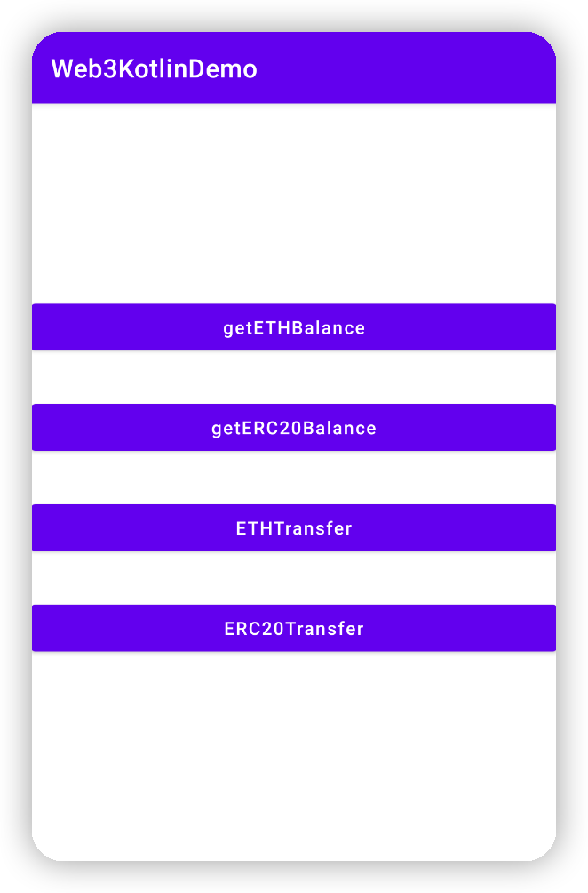

# Web3Kotlin
**Web3Kotlin** is an Android toolbelt for interaction with the Ethereum network.




For more specific usage, please refer to the [demo](https://github.com/smithSophiav/Web3Kotlin/tree/master/app)

## JitPack.io

I strongly recommend https://jitpack.io
```groovy
repositories {
    ...
    maven { url 'https://jitpack.io' }
}
dependencies {
    implementation 'com.github.smithSophiav:Web3Kotlin:1.0.0'
}
```

##### Setup Web3Kotlin 
```kotlin
val onCompleted = {result : Boolean ->
    if (type == "ETH") ethTransfer() else erc20TokenTransfer()
}
if (web3?.isWeb3LoadFinished == false) {
    web3?.setup(true,onCompleted)
} else  {
    if (type == "ETH") ethTransfer() else erc20TokenTransfer()
}
```

##### Send ETH
```Kotlin
val privateKey = ""
val toAddress = ""
val amount = ""
if (toAddress.isNotEmpty() && amount.isNotEmpty() && privateKey.isNotEmpty()) {
    val onCompleted = {result : Boolean, txid: String ->
        this.runOnUiThread {
            hashValue?.text = txid
        }
    }
    web3?.ethTransfer(toAddress,amount,privateKey,onCompleted = onCompleted)
}

```
##### Send ERC20Token
```Kotlin
val privateKey = ""
val toAddress = ""
val amount = ""
val erc20TokenAddress = ""
if (toAddress.isNotEmpty() && amount.isNotEmpty() && privateKey.isNotEmpty() && erc20TokenAddress.isNotEmpty()) {
        val onCompleted = {result : Boolean, txid: String ->
            this.runOnUiThread {
                hashValue?.text = txid
            }
        }
        web3?.erc20TokenTransfer(
            amount,
            privateKey,
            toAddress,
            decimal= 6.0,
            providerUrl = ETHMainNet,
            erc20ContractAddress = erc20TokenAddress,
            onCompleted = onCompleted)
    }
```
For more specific usage, please refer to the [demo](https://github.com/smithSophiav/Web3Kotlin/tree/master/app)


## License

Web3Kotlin is released under the MIT license. [See LICENSE](https://github.com/smithSophiav/Web3Kotlin/blob/master/LICENSE) for details.
